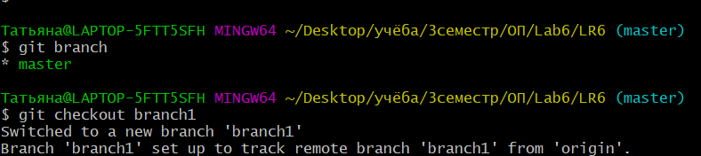

# LR6
Лабораторная работа №6

После установки Git было введено имя пользователя и email.


Далее создается копия(нажатием fork) репозитория в личное хранилище с помощью команды ```git clone <url>```.


Добавляется файл через интерфейс GitHub командой ```cd LR6/``` и подтягиваются изменения в локальный репозиторий командой ```git pull```


Посмотрим коммиты ветки master с помощью команды ```git log```


Просматриваем ветки в текущем репозитории и переходим в ветку branch1. Для этого используем команды ```git branch```, ```git checkout branch1```


Просматриваются коммиты ветки branch1 с помощью команды ```git log```


Рассматриваются последние изменения с помощью команды ```git log -p```


Выполняется слияние в ветку master командой ```git merge branch1```.
Решаем возникший конфликт. Добавляется файл для отслежививания, оставляется коммит. Используются команды ```git status```,```git add mergefile.txt```, ```git commit -m "mergefile conflict solved"```


После успешного слияния удаляется побочная ветка из локального репозитория и удаленного репозитория. В первом случае используем команду ```git branch -d branch1```, а для второго ```git push <url> --delete branch1```


Делаются несколько изменений и фиксируются с помощью команд ```git add```, ```git commit```


Далее делаем просмотр комментариев с помощью ```git log```


Делается "хард" откат коммита с помощью команды ```git reset --hard HEAD~1```


Создается ветка для отчёта с помощью команд ```git branch report```, ```git checkout report```


Оформляется отчет в файле README.md

Получаем итоговую историю операций с помощью команды ```git log```


После редактирования отчета, он был сохранен и были произведены команды ```git add```, ```git commit```

В конце работы все локальные изменения были отправлены в сетевое хранилище командой ```git push```.